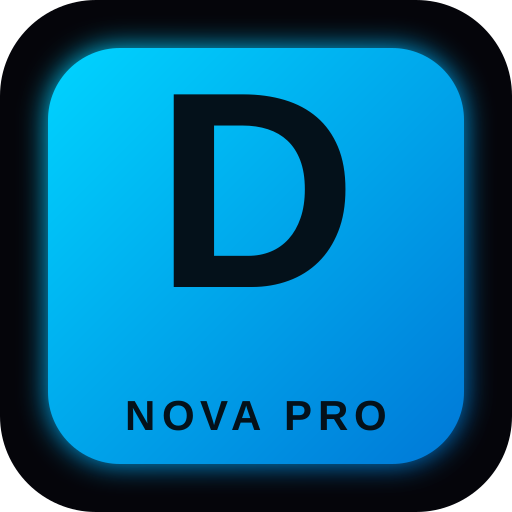

# DIB HAMICHE — NOVA PRO (Electron edition)

A modern, elegant, fast desktop browser built on Chromium via Electron,
customized for Algeria and branded **DIB HAMICHE**.



## Features

- Multi-tab browsing with draggable tabs, close buttons, and a `+` button.
- **Algeria clock** (`Africa/Algiers`) + French/Arabic date in the title bar
  and a big clock on the new-tab home page.
- **Smart omnibox** with switchable engines: Google, Bing, DuckDuckGo,
  Brave, Yandex, Startpage, Ecosia.
- **One-click shortcuts**: GLM 5.1 (ChatGLM), YouTube, Google Account login,
  Gmail, Translate, Maps, GitHub, …
- **Full internal pages** (served from the `dib://` scheme):
  - `dib://newtab`     — branded home with live clock + tile shortcuts
  - `dib://settings`   — search engine, language, homepage, privacy
  - `dib://bookmarks`  — add / remove bookmarks
  - `dib://history`    — searchable browsing history
  - `dib://downloads`  — list of downloads (saved under `~/Downloads/DIB-HAMICHE`)
  - `dib://passwords`  — local password vault
  - `dib://languages`  — interface language (FR / EN / AR)
  - `dib://updates`    — version & update check
  - `dib://about`      — about this build
- **Full window controls**: minimize / maximize / fullscreen (F11) / close.
- **Keyboard shortcuts**: `Ctrl+T` new tab, `Ctrl+W` close, `Ctrl+L` focus URL,
  `Ctrl+R` reload, `Ctrl+Tab` cycle tabs, `F11` fullscreen.
- **Downloads** auto-saved to `~/Downloads/DIB-HAMICHE/`.
- Local persistence (history, bookmarks, downloads, passwords, settings)
  in the user profile — nothing sent to any server.

## Run it (dev, on any OS)

```bash
cd electron-app
npm install
npm start
```

## Build the Windows `.exe`

The repo ships a GitHub Actions workflow
(`.github/workflows/build-dib-hamiche.yml`) that builds both an NSIS
installer (`DIB-HAMICHE-Setup-<ver>.exe`) and a portable single-file exe
(`DIB-HAMICHE-Portable-<ver>.exe`) on a Windows runner.

Locally on Windows:

```powershell
cd electron-app
npm install
npm run build:win
```

Artifacts are written to `electron-app/dist/`.

## Layout

```
electron-app/
├─ main.js             # Electron main process
├─ preload.js          # Preload for the browser shell
├─ preload-webview.js  # Preload injected into <webview>s (exposes dib:// APIs)
├─ index.html          # Browser shell (title bar, tabs, toolbar, viewport)
├─ renderer.js         # Tab/omnibox/clock logic
├─ styles.css          # Nova Pro dark theme
├─ pages/              # Internal dib:// pages
└─ assets/             # Icon + logo
```
